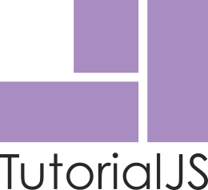

<p align="center"></p>

# Tutorialjs 

Tutorialjs is a library to do website tutorials using popups.

It helps new users to get into a new application, showing step by step on how to use all the components of the particular application. 

This library is based on [Semantic UI elements](https://semantic-ui.com/) and it uses [Semantic UI popups](https://semantic-ui.com/modules/popup.html).


## How to contribute

***This project is in alpha version (0.1.0).**

You can contribute following the contribution guidelines in [CONTRIBUTING.md](CONTRIBUTING.md).
Also check [issues](https://github.com/vinird/tutorialjs/issues) to start contributing to this project.


## Dependencies  

**JQuery**

The main dependency is JQuery, it also use Semantic UI styles and scripts but those are included in this repository.


## How to use tutorialjs

Add Semantic UI CSS components

```html
<link rel="stylesheet" href="tutorial/semantic_components/popup.min.CSS">
<link rel="stylesheet" href="tutorial/semantic_components/transition.min.CSS">
```

Add Semantic UI Scripts

```html
<script src="tutorial/semantic_components/transition.min.js"></script>
<script src="tutorial/semantic_components/popup.min.js"></script>
```

Include **Tutorialjs** script

```html
<script src="tutorial/tutorial.js"></script>
```

#### Optional

If you want to use Semantic UI button styles you can add the following:

```html
<link rel="stylesheet" href="tutorial/semantic_components/button.min.CSS">
```


### HTML

In order to link html tags with Tutorialjs you must add a **``tutorial``** class to each tag you want to have a step tutorial. Also, you need to include a custom property to define the index of the step; **``tutorial-index="index:int"``**.

```html
<div class="tutorial" tutorial-index="0">
  
</div>
```

By default the **start index is 0**.

To set a title and text to the popup you have to add two more custom attributes:

**``tutorial-title="title"``**

**``tutorial-text="text"``**

```html
<div class="tutorial" tutorial-index="0" tutorial-title="My title" tutorial-text="My text">
  
</div>
```


The following is a tutorial with three index steps:

```html
<div class="tutorial" tutorial-index="0" tutorial-title="My title" tutorial-text="My text">
</div>

<div class="tutorial" tutorial-index="1" tutorial-title="My title" tutorial-text="My text">
</div>

<div class="tutorial" tutorial-index="2" tutorial-title="My title" tutorial-text="My text">
</div>
```


### Javascript

Once you have setup the HTML you are ready to run the tutorial. The simplest way to do it is using the **``start``** function of the **Tutorial** object, as follow:

```javascript
Tutorial.start().then((success) => {
    console.warn(success)
}).catch((error) => {
    console.warn(error)
})
```

Tutorialjs runs the **`start`** function as a **async promise** so you must use **`then`** and **`catch`** to way for the response.


#### Success response:

|     Value      |                                          |
| :------------: | ---------------------------------------- |
|  **finished**  | When the tutorial finish.                |
|  **canceled**  | When the tutorial is canceled.           |
| **outOfIndex** | When the tutorial meets **endIndex** option. |
|  **onlyOnce**  | When the tutorial has runs and it has the **onlyOnce** option set to ``true``. |


#### Error response:

|           Value           |                                          |
| :-----------------------: | ---------------------------------------- |
| **Incorrect start index** | When the **startIndex** is not correct. Or **tutorial-index=""** is different than **startIndex**. |


## Options

The correct way to set options is to assign them before you trigger the **``start``** function, here an example:

```javascript
Tutorial.startIndex = 0;
Tutorial.endIndex   = 4;

Tutorial.start().then((success) => {
    console.warn(success)
}).catch((error) => {
    console.warn(error)
})
```

 

#### Options available

|             Name             |             Accepted values              | Description                              |           Default           |
| :--------------------------: | :--------------------------------------: | :--------------------------------------- | :-------------------------: |
|        **startIndex**        |                  `int`                   | Start index point.                       |              0              |
|         **endIndex**         |                  `int`                   | End index point.                         |             999             |
|         **selector**         |             JQuery selector              | Selector, example:  `".className"` `".intro,.demo"`  `"[href='default.htm']"`. |        `".tutorial"`        |
|         **onlyOnce**         |              `true` `false`              | It uses the current URL to determinate if the tutorial was already ran. And sets cookies to evaluate it next time it runs. |           `false`           |
|          **styles**          |              `true` `false`              | Applies custom styles to the container of each step. |          ``true``           |
|        **bodyScroll**        |              `true` `false`              | If true it uses `"body"` tag to scroll otherwise it uses `"html"` tag. |          ``false``          |
| **removeAnimationConflicts** |              `true` `false`              | If true it overrides `".animated"` class with CSS ``animation: unset``. This helpful if you are using Animate.CSS. |          ``false``          |
|       **btnFramework**       | `"semantic"` `"bootstrap"` `"materialize"` ``"custom"`` | Set the CSS framework for styling the buttons. If you use ``"custom"`` you must set ``btnFinishClass`` and  ``btnNextClass``. |       ``"semantic"``        |
|      **btnFinishText**       |                 `string`                 | Set the text for the finish button.      |        ``"Cancel"``         |
|      **btnFinishClass**      |                 `string`                 | Set the custom classes for the finish button. | ``"ui button tiny basic"``  |
|       **btnNextText**        |                 `string`                 | Set the text for the next button.        |         ``"Next"``          |
|       **btnNextClass**       |                 `string`                 | Set the custom classes for the next button. | ``"ui button tiny primary`` |


## License 

The Tutorialjs library is an open-sourced software licensed under the [MIT License](https://opensource.org/licenses/MIT).
